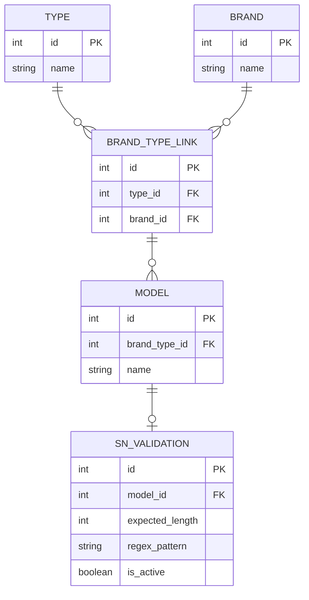
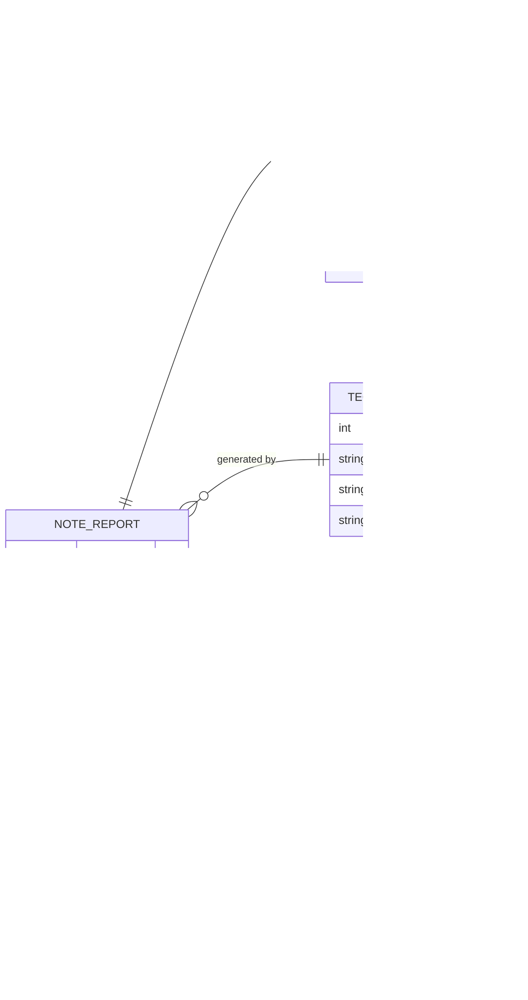

## Database Schema (ERD)

#### Note generation tables

```mermaid

erDiagram
    direction TB

    TYPE ||--o{ BRAND_TYPE_LINK : ""
    BRAND ||--o{ BRAND_TYPE_LINK : ""
    BRAND_TYPE_LINK ||--o{ MODEL : ""
    
    MODEL ||--o| SN_VALIDATION : ""
    
    TYPE {
        int id PK
        string name
    }

    BRAND {
        int id PK
        string name
    }

    BRAND_TYPE_LINK {
        int id PK
        int type_id FK
        int brand_id FK
    }

    MODEL {
        int id PK
        int brand_type_id FK
        string name
    }

    SN_VALIDATION {
        int id PK
        int model_id FK
        int expected_length
        string regex_pattern
        boolean is_active
    }
```

---

#### Note history tables

```mermaid

erDiagram
    direction LR

    NOTE_REPORT ||--|{ NOTE_ITEM : ""
    NOTE_REPORT }o--|| TECHNICIAN_PROFILE : "generated by"

    NOTE_REPORT ||--o| NOTE_ENTREGA_DEVOLUCION : ""
    NOTE_REPORT ||--o| NOTE_PROVEEDOR : ""
    
    NOTE_REPORT {
        int id PK
        timestamp created_at
        string profile_type
        boolean glpi_synced
    }

    NOTE_ENTREGA_DEVOLUCION {
        int note_report_id PK, FK
        str user_name
        str user_dni
        str user_email
    }

    NOTE_PROVEEDOR {
        int note_report_id PK, FK
        str provider_name
    }

    NOTE_ITEM {
        int id PK
        int note_id FK
        string type_name
        string brand_name
        string model_name
        string serial_number
        string a_f
        int quantity
    }

    TECHNICIAN_PROFILE {
        int id PK
        string name
        string dni
        string email
    }
```